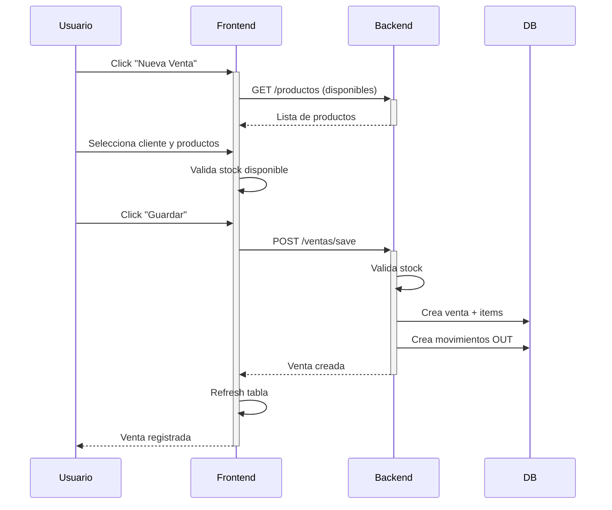

# 🚀 Release Notes - Sistema de Gestión Comercial v2.0.0

## 📅 Fecha de Release
**Octubre 13, 2025**

---

## 🎯 Resumen Ejecutivo

**Sistema de Gestión v2.0** representa un cambio fundamental en la arquitectura del sistema, migrando de un frontend React/Node.js a una solución **Python-first** con **FastAPI + Jinja2 + HTMX**. Este cambio elimina la dependencia de Node.js y proporciona una experiencia de desarrollo más unificada y eficiente.

---

## ✨ Características Principales

### 🆕 Nueva Arquitectura Frontend

- **Stack Tecnológico**:
  - FastAPI para routing y lógica de negocio
  - Jinja2 para templating server-side
  - HTMX para interacciones dinámicas (sin JavaScript custom)
  - Tailwind CSS via CDN para estilos

- **Ventajas**:
  - ✅ Sin dependencia de Node.js
  - ✅ Backend y frontend en el mismo proceso
  - ✅ Menos complejidad de deployment
  - ✅ Mejor rendimiento (sin build step)
  - ✅ Desarrollo más rápido

### 📦 Módulos Implementados

#### 1. **Productos** ✅
- CRUD completo (Crear, Leer, Actualizar, Eliminar)
- Control de stock integrado
- Búsqueda y filtros
- Paginación
- Exportación a XLSX
- Activar/Desactivar productos

#### 2. **Clientes** ✅
- CRUD completo
- Búsqueda por nombre, email, teléfono
- Paginación
- Exportación a XLSX
- Gestión de información de contacto

#### 3. **Proveedores** ✅
- CRUD completo
- Búsqueda por nombre, contacto, CUIT
- Paginación
- Exportación a XLSX
- Gestión de información de contacto

#### 4. **Ventas** ✅
- Creación de ventas con múltiples items
- Selección de cliente (o consumidor final)
- Validación de stock en tiempo real
- Cálculo automático de totales
- Listado con filtros y búsqueda
- Vista detallada de cada venta
- Cambio de estado (Pendiente → Completada)
- Control automático de stock (resta al crear)
- Eliminación con confirmación

#### 5. **Compras** ✅
- Creación de compras con múltiples items
- Selección de proveedor
- Cálculo automático de totales
- Listado con filtros y búsqueda
- Vista detallada de cada compra
- Cambio de estado (Pendiente → Completada)
- Control automático de stock (suma al crear)
- Eliminación con confirmación

---

## 🔧 Mejoras de Backend

### Nuevos Endpoints
```python
PATCH /ventas/{id}/estado?estado=completada
PATCH /compras/{id}/estado?estado=completada
GET /productos/export
GET /clientes/export
GET /proveedores/export
```

### Stock Service Mejorado
- Cálculo desde `StockMovimiento` (movimientos IN/OUT)
- Fallback a stock inicial del producto si no hay movimientos
- Prevención de ventas con stock insuficiente
- Validación en frontend y backend

### Error Handling
- Páginas de error personalizadas (403, 404, 500)
- Manejo centralizado de excepciones
- Mensajes de error descriptivos

### Performance
- Redis caching implementado
- Query optimization
- Structured logging (JSON format)
- Performance monitoring

---

## 🐳 Infraestructura

### Docker Compose Simplificado
```yaml
servicios:
  - postgres:15 (Base de datos)
  - redis:7-alpine (Cache)
  - backend (FastAPI + Frontend web)
```

### GitHub Actions CI/CD
- **CI**: Linting, tests, security scanning
- **CD**: Docker build & push, deployment automation

### Scripts de Inicio
- `start_web.sh` (Linux/Mac)
- `start_web.bat` (Windows)
- `docker-compose up -d` (Producción)

---

## 📚 Documentación

| Documento | Descripción |
|-----------|-------------|
| `README.md` | Guía principal del proyecto |
| `FRONTEND_PYTHON.md` | Arquitectura del módulo web |
| `DOCKER_GUIA.md` | Guía de Docker y deployment |
| `DEPLOY_PRODUCCION.md` | Guía de deployment a producción |
| `GUIA_USO_MVP.md` | Manual de usuario del MVP |
| `CHANGELOG.md` | Historial de cambios |

---

## 🐛 Bugs Corregidos

### 1. Stock Insuficiente
**Problema**: Mensaje de "stock insuficiente" incluso cuando había stock disponible.

**Solución**: 
- Stock service ahora calcula correctamente desde movimientos
- Fallback a stock inicial si no hay movimientos
- Validación en frontend antes de agregar items

### 2. IDs en Lugar de Nombres
**Problema**: Tablas mostraban `cliente_id` y `proveedor_id` en lugar de nombres.

**Solución**:
- Enriquecimiento de datos con nombres de clientes/proveedores
- Mapeo automático en los routers web
- Mejor UX en listados

### 3. Botón Completar No Funcional
**Problema**: El botón de completar ventas/compras no ejecutaba ninguna acción.

**Solución**:
- Endpoints PATCH agregados al backend
- Routers web actualizados para llamar a los endpoints
- Confirmación con diálogo modal
- Refresh automático de la tabla

---

## 🎯 Flujo de Trabajo Completo

### Escenario: Nueva Venta



---

## 📊 Estadísticas del Release

- **148 archivos modificados**
- **9,084 líneas agregadas**
- **5,747 líneas eliminadas**
- **7 módulos web nuevos**
- **24 templates Jinja2**
- **3 workflows CI/CD**
- **6 documentos técnicos**

---

## 🚀 Cómo Empezar

### Opción 1: Docker (Recomendado)
```bash
# Clonar el repositorio
git clone https://github.com/JonatanSotelo/sistema-comercial.git
cd sistema-comercial/sistema-comercial

# Iniciar con Docker
docker-compose up -d

# Acceder al sistema
# Web: http://localhost:8000/app
# API: http://localhost:8000/docs
```

### Opción 2: Desarrollo Local
```bash
# Backend
cd backend
pip install -r requirements.txt
uvicorn app.main:app --reload

# Acceder al sistema
# Web: http://localhost:8000/app
```

### Credenciales por Defecto
```
Usuario: admin
Contraseña: admin123
```

---

## 🔮 Próximos Pasos (Roadmap)

### v2.1 (Corto Plazo)
- [ ] Dashboard con métricas en tiempo real
- [ ] Reportes avanzados (ventas, compras, stock)
- [ ] Gestión de descuentos y promociones
- [ ] Notificaciones por email

### v2.2 (Mediano Plazo)
- [ ] Multi-empresa / Multi-sucursal
- [ ] Roles y permisos granulares
- [ ] Integración con APIs de proveedores
- [ ] Facturación electrónica (AFIP)

### v3.0 (Largo Plazo)
- [ ] Mobile app (Flutter)
- [ ] BI y analytics avanzado
- [ ] Machine learning para predicción de stock
- [ ] Marketplace integrado

---

## 🤝 Contribuciones

Este proyecto es mantenido por el equipo de desarrollo de Telecom Argentina.

Para contribuir:
1. Fork el repositorio
2. Crea una rama feature (`git checkout -b feature/AmazingFeature`)
3. Commit tus cambios (`git commit -m 'Add AmazingFeature'`)
4. Push a la rama (`git push origin feature/AmazingFeature`)
5. Abre un Pull Request

---

## 📞 Soporte

Para reportar bugs o solicitar features, por favor abre un issue en GitHub:
https://github.com/JonatanSotelo/sistema-comercial/issues

---

## 📄 Licencia

Este proyecto es propiedad de Telecom Argentina SA.

---

## 🙏 Agradecimientos

Gracias a todos los que contribuyeron a hacer este release posible:
- Equipo de Backend
- Equipo de Frontend
- DevOps
- QA
- Product Management

---

**¡Disfruta del Sistema de Gestión v2.0!** 🎉

